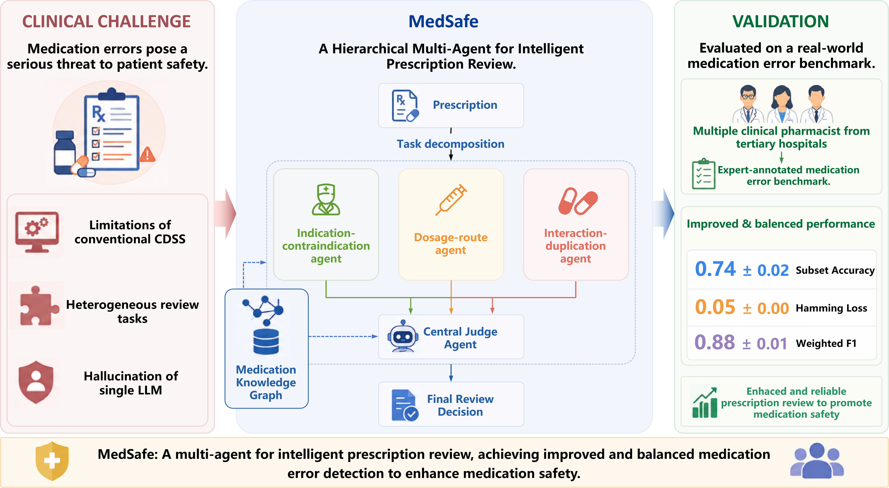

# MedSafe



This project runs batch prescription audits by driving `opencode` in non-interactive mode and letting it retrieve evidence from Neo4j through MCP tools.

The workflow is:

1. Start `opencode serve` with a project-local `opencode.json` and `AGENTS.md`
2. Read `prescription_benchmark.json`
3. Build three sub-agent prompts per prescription
4. Call `opencode run --attach ... --dir ...`
5. Parse one strict JSON result per prescription
6. Compute binary, multilabel, and relation-edge metrics
7. Export configurable result files

The project can also run a three-agent audit. In that mode only three
specialist sub-agents are executed:

- `agent_1`: B/D audit labels, sharing dosage, route, form, frequency, and population-specific evidence.
- `agent_2`: C/G audit labels, using indication, contraindication, precaution, special-population, and clinical-fact evidence.
- `agent_3`: E/F audit labels, using interaction or incompatibility evidence for E and prescription-content judgement for F.

Each sub-agent returns separate audit-label results so the final JSON
schema and benchmark metrics remain compatible with B/C/D/E/F/G labels.

The three sub-agent prompts follow the same skill + prompt style as the
reference KG audit project. By default, each sub-agent uses a dedicated skill:
`agent_1 -> prescription-audit-1`, `agent_2 -> prescription-audit-2`, and
`agent_3 -> prescription-audit-3`. The Chinese prompt text only supplies the
sub-agent task boundary, prescription context, and strict JSON schema. The
concrete knowledge-graph retrieval strategy stays inside the corresponding skill.

## Directory layout

```text
MedSafe/
  configs/
    eval_config.example.json
  opencode_project/
    AGENTS.md
    opencode.json
  src/opencode_kg_batch_eval/
    config.py
    io_utils.py
    labels.py
    metrics.py
    opencode_runner.py
    parsing.py
    pipeline.py
  run_batch_eval.py
  requirements.txt
```

## Quick start

1. Prepare `opencode_project/opencode.json`
   Point the provider to your working local `vLLM` endpoint and configure the `neo4j` MCP server.

2. Copy and edit the config sample

```bash
cp configs/eval_config.example.json configs/eval_config.json
```

3. Start the OpenCode backend

```bash
cd /path/to/MedSafe/opencode_project
opencode serve --port 7000
```

4. Run a smoke test on a few prescriptions

```bash
python run_batch_eval.py \
  --config configs/eval_config.json \
  --input-json /home/tr/Data_folder/LLM_for_medication/Dataset/prescription_benchmark.json \
  --output-root /home/tr/Data_folder/LLM_for_medication/llm_eval/opencode_kg_batch_smoke \
  --limit 5
```

5. Run the full 120-prescription evaluation

```bash
python run_batch_eval.py \
  --config configs/eval_config.json \
  --input-json /home/tr/Data_folder/LLM_for_medication/Dataset/prescription_benchmark.json \
  --output-root /home/tr/Data_folder/LLM_for_medication/llm_eval/opencode_kg_batch_full
```

## Output files

Depending on the config, the runner writes:

- `progress.csv`
- `raw_outputs.jsonl`
- `prescription_results.csv`
- `metrics_binary.csv`
- `metrics_multilabel.csv`
- `metrics_edge.csv`
- `leaderboard.csv`
- `summary.json`

## Notes

- This project intentionally keeps the prompt and parsing strict. The model is asked to output exactly one JSON object.
- The benchmark parsing and metrics stay aligned with the earlier KG audit project so results remain comparable.
- If you want to benchmark multiple models, add multiple runs with different `run_name`, `attach_url`, or `model` overrides.
- Keep `multi_agent.enabled` set to `true`; this project is the three-sub-agent version and the legacy single-prompt path has been removed. The default sub-agents are `agent_1` for B/D, `agent_2` for C/G, and `agent_3` for E/F.
- `multi_agent.subagent_skill_names` maps `agent_1`, `agent_2`, and `agent_3` to `prescription-audit-1`, `prescription-audit-2`, and `prescription-audit-3`.
- `multi_agent.skill_name` is only a fallback used when a sub-agent has no dedicated entry in `multi_agent.subagent_skill_names`.
- Multi-agent intermediate outputs are written into `raw_outputs.jsonl` and `opencode_debug.jsonl` as `agent_trace`.
