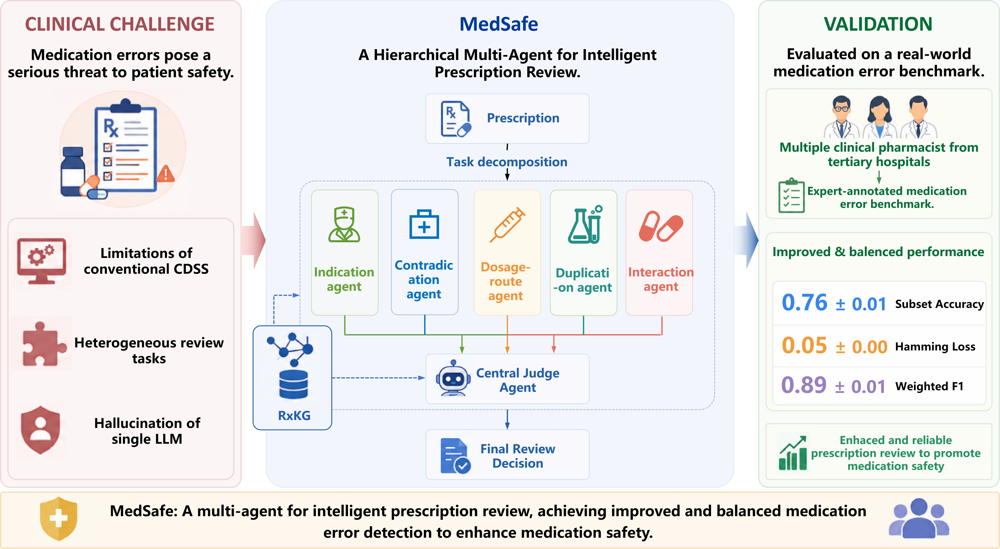

# MedSafe




This project runs batch prescription audits by driving `opencode` in non-interactive mode and letting it retrieve evidence from Neo4j through MCP tools.

Task allocation for sub-agent:
- `agent_1`: B/D audit labels, sharing dosage, route, form, and frequency evidence.
- `agent_2`: C/G audit labels, using indication, contraindication, precaution, and special-population evidence.
- `agent_3`: E/F audit labels, using interaction or incompatibility and therapeutic duplication evidence.

## Directory layout

```text
MedSafe/
  configs/
    eval_config.example.json
  opencode_project/
    AGENTS.md
    opencode.json
  src/opencode_kg_batch_eval/
    config.py
    io_utils.py
    labels.py
    metrics.py
    opencode_runner.py
    parsing.py
    pipeline.py
  run_batch_eval.py
  requirements.txt
```

## Quick start

1. Prepare `opencode_project/opencode.json`
   Point the provider to your working local `vLLM` port and configure the `neo4j` MCP server.

2. Prepare `configs/eval_config.json`

Point the provider to your working local `vLLM` port and configure the `Opencode` server.

3. Start the OpenCode backend

```bash
cd /path/to/MedSafe/opencode_project
opencode serve --port 7000
```

4. Run test on a prescriptions sample

```bash
python run_batch_eval.py \
  --config configs/eval_config.json \
  --input-json /path/to/Dataset/prescription_benchmark.json \
  --output-root /path/to/outputs
```

## Output files

Depending on the config, the runner writes:

- `progress.csv`
- `raw_outputs.jsonl`
- `prescription_results.csv`
- `metrics_binary.csv`
- `metrics_multilabel.csv`
- `metrics_edge.csv`
- `leaderboard.csv`
- `summary.json`

# Contact
For any inquiries or assistance, please contact the corresponding authors:
     
&nbsp;&nbsp;&nbsp;&nbsp;&nbsp;&nbsp;&nbsp;&nbsp;&nbsp;&nbsp;&nbsp;&nbsp;• Rui Tang (442359065@qq.com)
